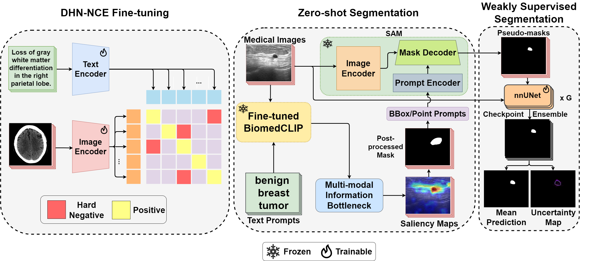
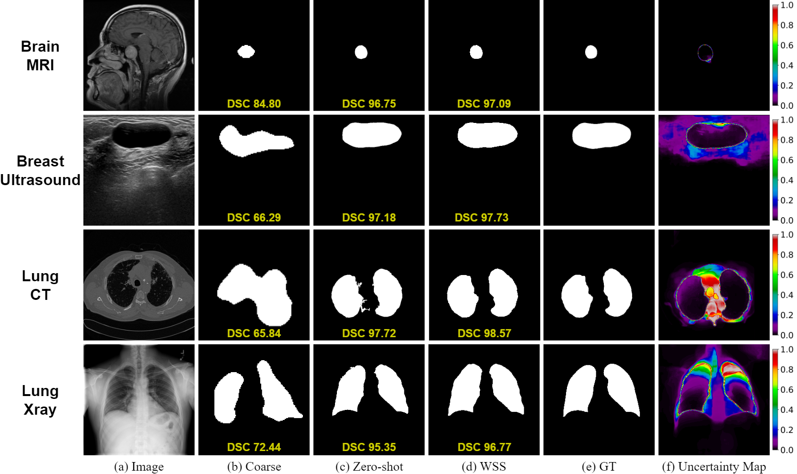

# MedCLIP-SAMv2: Towards Universal Text-Driven Medical Image Segmentation

**[Health-X Lab](http://www.healthx-lab.ca/)** | **[IMPACT Lab](https://users.encs.concordia.ca/~impact/)** 

[Taha Koleilat](https://tahakoleilat.github.io/), [Hojat Asgariandehkordi](https://scholar.google.com/citations?user=ndXNye4AAAAJ&hl=en), [Hassan Rivaz](https://users.encs.concordia.ca/~hrivaz/), [Yiming Xiao](https://yimingxiao.weebly.com/curriculum-vitae.html)

[](https://www.arxiv.org/abs/2409.19483)
[](#overview)
[](#datasets)
[](#colab-demo)
[](#citation)

## Updates
Due to the many requests we received for releasing the BiomedCLIP fine-tuning code, we have updated the repo and added the necessary code to do so. Follow the steps [here](#how-to-run)

## Overview

_**Abstract:** Segmentation of anatomical structures and pathological regions in medical images is essential for modern clinical diagnosis, disease research, and treatment planning. While significant advancements have been made in deep learning-based segmentation techniques, many of these methods still suffer from limitations in data efficiency, generalizability, and interactivity. As a result, developing precise segmentation methods that require fewer labeled datasets remains a critical challenge in medical image analysis. Recently, the introduction of foundation models like CLIP and Segment-Anything-Model (SAM), with robust cross-domain representations, has paved the way for interactive and universal image segmentation. However, further exploration of these models for data-efficient segmentation in medical imaging is still needed and highly relevant. In this paper, we introduce MedCLIP-SAMv2, a novel framework that integrates the CLIP and SAM models to perform segmentation on clinical scans using text prompts, in both zero-shot and weakly supervised settings. Our approach includes fine-tuning the BiomedCLIP model with a new Decoupled Hard Negative Noise Contrastive Estimation (DHN-NCE) loss, and leveraging the Multi-modal Information Bottleneck (M2IB) to create visual prompts for generating segmentation masks from SAM in the zero-shot setting. We also investigate using zero-shot segmentation labels within a weakly supervised paradigm to enhance segmentation quality further. Extensive testing across four diverse segmentation tasks and medical imaging modalities (breast tumor ultrasound, brain tumor MRI, lung X-ray, and lung CT) demonstrates the high accuracy of our proposed framework._

### Framework

<p float="left">
  
</p>

### Sample Segmentation Results
<p float="left">
  
</p>

## Datasets
Public datasets used in our study:
- [Radiology Objects in COntext (ROCO)](https://github.com/razorx89/roco-dataset)
- [MedPix](https://drive.google.com/file/d/1GrTyC08-CwP90TKO2aoMOj0tTyNiafjd/view?usp=sharing)
- [Breast UltraSound Images (BUSI)](https://www.kaggle.com/datasets/aryashah2k/breast-ultrasound-images-dataset)
- [UDIAT](https://drive.google.com/file/d/1txsA6eNFZciIrbqzwS3uOcnnkiEh3Pt4/view?usp=drive_link)
- [COVID-QU-Ex](https://www.kaggle.com/datasets/anasmohammedtahir/covidqu)
- [Brain Tumors](https://www.kaggle.com/datasets/ashkhagan/figshare-brain-tumor-dataset)
- [Lung CT](https://www.kaggle.com/datasets/polomarco/chest-ct-segmentation)

You can download the segmentation datasets [here](https://drive.google.com/file/d/1uYtyg3rClE-XXPNuEz7s6gYq2p48Z08p/view?usp=sharing).

Create a directory for your data that you want to work with in the main working directory like the following:

```shell
data
├── breast_tumors
│   ├── train_images           
│   ├── train_masks             
│   ├── val_images        
│   ├── val_masks         
│   ├── test_images       
│   └── test_masks        
│
├── brain_tumors
│   ├── train_images            
│   ├── train_masks            
│   ├── val_images        
│   ├── val_masks         
│   ├── test_images       
│   └── test_masks        
│
└── ...        
```

## Colab Demo

Interactive Colab demo: [](https://colab.research.google.com/drive/1Hf_ticAbO7Oyh5Rat2XqQ-FAkm4vk3RQ?usp=sharing)

## Prerequisites & Installation
Install anaconda following the [anaconda installation documentation](https://docs.anaconda.com/anaconda/install/).
Create an environment with all required packages with the following command :
```bashscript
conda env create -f medclipsamv2_env.yml
conda activate medclipsamv2
```
then setup the segment-anything library:
```bashscript
cd segment-anything
pip install -e .
cd ..
```
finally setup the nnUNet framework:
```bashscript
cd weak_segmentation
pip install -e .
cd ..
```

### <a name="Models"></a>SAM Model Checkpoints

Three model versions of the SAM model are available with different backbone sizes. These models can be instantiated by running

Click the links below to download the checkpoint for the corresponding model type and place it at `segment-anything/sam_checkpoints/sam_vit_h_4b8939.pth`

- **`default` or `vit_h`: [ViT-H SAM model.](https://dl.fbaipublicfiles.com/segment_anything/sam_vit_h_4b8939.pth)**
- `vit_l`: [ViT-L SAM model.](https://dl.fbaipublicfiles.com/segment_anything/sam_vit_l_0b3195.pth)
- `vit_b`: [ViT-B SAM model.](https://dl.fbaipublicfiles.com/segment_anything/sam_vit_b_01ec64.pth)

## How to run
### DHN-NCE Loss
You can fine-tune the BiomedCLIP pre-trained model using our [DHN-NCE Loss](https://github.com/HealthX-Lab/MedCLIP-SAMv2/tree/main/loss).

Place your image-text dataset in `biomedclip_finetuning/open_clip/src/data` (please refer to the [MedPix](https://drive.google.com/file/d/1GrTyC08-CwP90TKO2aoMOj0tTyNiafjd/view?usp=sharing) dataset to see how your custom dataset should be structured)

You can then start fine-tuning BiomedCLIP like this:
```bash
bash biomedclip_finetuning/open_clip/scripts/biomedclip.sh
```

If you have the model saved with the `.pt` format, you can convert it to `.bin` by moving the saved model checkpoint to `saliency_maps/model` and then calling:

```python
python saliency_maps/model/convert.py
```

Our fine-tuned model can be downloaded [here](https://drive.google.com/file/d/1jjnZabUlc9_gpcP0d2nz_GNS-EGX0lq5/view?usp=sharing). Place it at `saliency_maps/model/pytorch_model.bin`

### Zero-shot Segmentation
You can run the whole zero-shot framework with the following:

```bashscript
bash zeroshot.sh <path/to/dataset>
```
You can change the settings by specifying which CLIP model you want to use, the post-processing algorithm, the SAM model and the type of visual prompts to use (boxes/points/both).

The text prompts we used can be found [here](https://github.com/HealthX-Lab/MedCLIP-SAMv2/blob/main/saliency_maps/text_prompts.py).

Some zeroshot_scripts to reproduce the results are found at `zeroshot_scripts`.

### Weakly Supervised Segmentation

Go to `weak_segmentation`:

```bashscript
cd weak_segmentation
```

#### Dataset Prepartion
Please follow this [guideline](https://github.com/MIC-DKFZ/nnUNet/blob/master/documentation/dataset_format.md) to prepare your datasets. Place all your prepared datasets in `data`.

#### Preprocessing

```bash
nnUNetv2_plan_and_preprocess -d DATASET_ID --verify_dataset_integrity
```

#### Training
```bash
nnUNetv2_train DATASET_ID 2d all --npz --num_epochs EPOCHS --num_of_cycles CYCLES
```

#### Inference and Uncertainty

```bash
nnUNetv2_predict_from_folder --dataset DATASET_ID --fold all --input_folder INPUT_PATH --output_folder OUTPUT_PATH --rule RULE
```

```bash
nnUNetv2_run_uncertainty_on_fold --proba_dir PATH --raw_path PATH --labels PATH --score_type TYPE --output_pred_path PATH
```

## Acknowledgements

Special thanks to [open_clip](https://github.com/mlfoundations/open_clip), [M2IB](https://github.com/YingWANGG/M2IB), [nnUNet](https://github.com/MIC-DKFZ/nnUNet), and [segment-anything](https://github.com/facebookresearch/segment-anything) for making their valuable code publicly available.

## Citation

If you use MedCLIP-SAM, please consider citing:

    @article{koleilat2024medclipsamv2,
      title={MedCLIP-SAMv2: Towards Universal Text-Driven Medical Image Segmentation},
      author={Koleilat, Taha and Asgariandehkordi, Hojat and Rivaz, Hassan and Xiao, Yiming},
      journal={arXiv preprint arXiv:2409.19483},
      year={2024}
    }

    @inproceedings{koleilat2024medclip,
      title={MedCLIP-SAM: Bridging text and image towards universal medical image segmentation},
      author={Koleilat, Taha and Asgariandehkordi, Hojat and Rivaz, Hassan and Xiao, Yiming},
      booktitle={International Conference on Medical Image Computing and Computer-Assisted Intervention},
      pages={643--653},
      year={2024},
      organization={Springer}
    }
